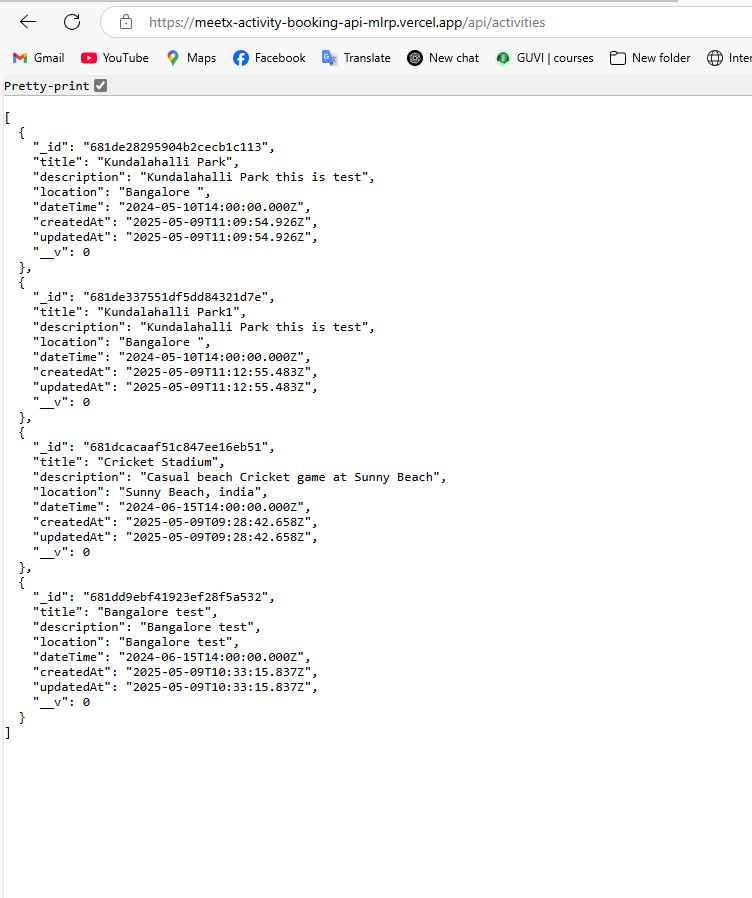

# MeetX Booking App-Assignent

## Overview
This is a RESTful API for booking activities such as cricket, movies, or football matches. Users can register, login, view available activities, and make bookings.

## Tech Stack
- Node.js
- Express.js
- MongoDB Atlas
- JWT Authentication
- bcrypt for password hashing
- express-validator for validation

## Features
- User registration and login with JWT auth
- List all available activities (public)
- Book an activity (auth required)
- Get your own bookings

## Setup Instructions

### 1. Clone Repo
```bash
git clone https://github.com/Amansagar1/MEETX-Activity_Booking_Api.git
cd MeetX Booking App-Assignent
npm install
npm start ---- with Nodemon
same with npm run dev


----for register  add in body 
{
  "name": "Sagar Sharma",
  "email": "sagar@example.com",
  "phone": "1234567890",
  "password": "123456"
}
--------for login  add in body 
{
  "email": "sagar@example.com",
  "password": "123456"
}

--------for activity add in body 

{
    "title": "Bangalore test",
    "description": "Bangalore test",
    "location": "Bangalore test",
    "dateTime": "2024-06-15T14:00:00.000Z",
    "_id": "681dd9ebf41923ef28f5a532",
    "createdAt": "2025-05-09T10:33:15.837Z",
    "updatedAt": "2025-05-09T10:33:15.837Z",
    "__v": 0
}
--------for booking add in body 

{
  "activityId": "681dd9ebf41923ef28f5a532"
}

# urls
- http://localhost:5000/api/activities
- http://localhost:5000/api/activities
- http://localhost:5000/api/bookings/mybookings
- http://localhost:5000/api/bookings?activityId=681de337551df5dd84321d7e
- http://localhost:5000/api/auth/register
- http://localhost:5000/api/auth/login


spacial for chacking password its hased or not 
- http://localhost:5000/api/dev/users


Deployed link - https://meetx-activity-booking-api-mlrp.vercel.app/
deployed acsses test - https://meetx-activity-booking-api-mlrp.vercel.app/api/activities
